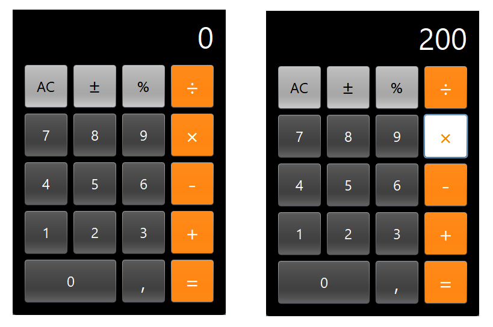

## CalculadoraJava

The calculator was developed with graphic interface in Java language and inspired by the IOS calculator. There are basic features like sum, subtraction, multiplication and division, including percentage. Many tests were done, so i believe that anything go wrong with you! Go on and clone the calculator to your PC. 

